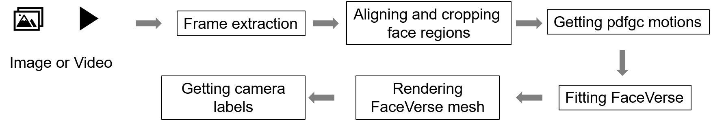

# <u>Data Preprocessing Pipeline</u> by *AvatarArtist* 
This repo describes how to process your own data for using our model.

## 🎉 Overview

<div align=center>

</div>

## ⚙️ Requirements and Installation

We recommend the requirements as follows.

### Environment

```bash
git clone --depth=1 https://github.com/ant-research/AvatarArtist 
cd AvatarArtist
conda create -n avatarartis python=3.9.0
conda activate avatarartist
pip install -r requirements.txt
```

### Download Weights

The weights are available at [🤗HuggingFace](https://huggingface.co/KumaPower/AvatarArtist), you can download it with the following commands. Please move the required files into the `pretrained_model` directory:

```bash
# if you are in china mainland, run this first: export HF_ENDPOINT=https://hf-mirror.com
huggingface-cli download --repo-type model \
KUMAPOWER/AvatarArtist \
--local-dir pretrained_model
```


## 🗝️ Usage
Process the target video to obtain the target pose motion and mesh.

```bash
python3 input_img_align_extract_ldm.py --input_dir ./demo_data/hongyu_2.mp4 --is_video --save_dir ./demo_data/data_process_out
```

Process the image to extract the source image.


```bash
python3 input_img_align_extract_ldm.py --input_dir ./demo_data/ip_imgs --is_img --save_dir ./demo_data/data_process_out 
```
Our code supports step-by-step data processing. For example, if your images are already aligned, you can proceed directly to the next step.

```bash
python3 input_img_align_extract_ldm.py --input_dir ./demo_data/ip_imgs --is_img --save_dir ./demo_data/data_process_out  --already_align
```

Once ready, the data will be organized in this format:

```
📦 datasets/
├── 📂 dataset/
│   ├── 📂 coeffs/
│   ├── 📂 images512x512/
│   ├── 📂 uvRender256x256/
│   ├── 📂 orthRender256x256_face_eye/
│   ├── 📂 motions/
├── 📂 crop_fv_tracking/
├── 📂 realign_detections/
├── 📂 realign_detections/
├── 📂 realign/
├── 📂 raw_detection/
├── 📂 align_3d_landmark/
├── 📂 raw_frames/
```

## 👍 Credits

- This code builds on [Portrait4D](https://github.com/YuDeng/Portrait-4D) and [InvertAvatar](https://github.com/XChenZ/invertAvatar). We have integrated and organized their data processing code. Thanks for open-sourcing!
 